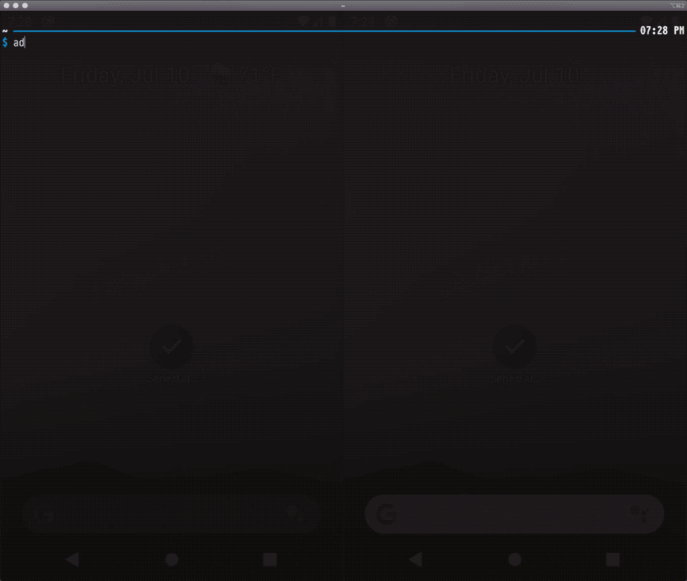

# ADB Event Mirror

Consume the output of `getevent` from one device and redirect it to one or more devices as
individual `sendevent` commands. This allows you to mirror the interaction of one device on another.

The script makes no attempt at normalizing resolution, density, orientation, or layout differences.
It works best with emulators which have been created with the exact same configuration.

[](demo.gif)

## Usage

```
$ adb devices
List of devices attached
emulator-5554	device
emulator-5556	device

$ adb -s emulator-5554 shell getevent | /path/to/adb-event-mirror.main.kts emulator-5556
ready!

EVENT /dev/input/event1 3 57 0
EVENT /dev/input/event1 3 48 7
EVENT /dev/input/event1 3 58 129
EVENT /dev/input/event1 3 53 25812
EVENT /dev/input/event1 3 54 31666
EVENT /dev/input/event1 0 0 0
EVENT /dev/input/event1 3 58 0
EVENT /dev/input/event1 3 57 4294967295
EVENT /dev/input/event1 0 0 0
 ⋮
```

In order for the script to work you must have both `kotlin` and `adb` available on your shell path.

Since the script reads events from stdin, you can also record events and replay them later.

```
$ adb shell getevent > clear_recents.txt

$ cat clear_recents.txt | /path/to/adb-event-mirror.main.kts emulator-5554
ready!

EVENT /dev/input/event1 3 57 0
 ⋮
```


# License

    Copyright 2020 Jake Wharton

    Licensed under the Apache License, Version 2.0 (the "License");
    you may not use this file except in compliance with the License.
    You may obtain a copy of the License at

       http://www.apache.org/licenses/LICENSE-2.0

    Unless required by applicable law or agreed to in writing, software
    distributed under the License is distributed on an "AS IS" BASIS,
    WITHOUT WARRANTIES OR CONDITIONS OF ANY KIND, either express or implied.
    See the License for the specific language governing permissions and
    limitations under the License.
